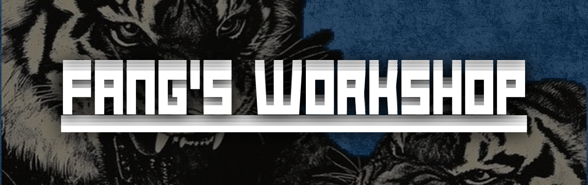

  

<h1 align="center">4PEXHUNTER</h1>
<h3 align="center">Founder & Owner of Fang's Workshop</h3>

<i>Indie Game Dev • Game Designer • Programmer</i>

  
  
  

---

## Hey, I'm 4pexhunter!

I build games solo under **Fang's Workshop**: fast, chaotic, and made with a lot of love (and a lot of coffee). I design the mechanics, write the code, and break my own games so you don't have to.

  

| | |
|---|---|
| **Studying at** | SMK Telkom Malang |
| **Game dev experience** | 5+ years |
| **Currently learning** | C# and Construct 2 |

---

## Tech Stack

### Engines & Tools

  
  
  
  

### Languages

  
  
  
  
  

### Skill Breakdown

| Technology | Focus | Level |
|---|---|---|
| **Godot / GDScript** | Gameplay programming | Advanced |
| **GameMaker / GML** | 2D game systems | Advanced |
| **Roblox Studio / Luau** | Building, scripting, server logic | Advanced |
| **C#** | Game logic and OOP | Learning |
| **Python** | Tools, scripts, automation | Learning |
| **Construct 2** | Rapid 2D prototyping | Exploring |

### Roles
- **Game Designer:** mechanics, systems, game feel
- **Junior Programmer:** gameplay, AI, multiplayer systems
- **Builder:** level and world design in Roblox Studio

---

## Currently Inspired By

| Studio | Known For |
|---|---|
| **Dennaton Games** | *Hotline Miami* |
| **Ultra CDG** | *Washington Prime* |
| **Edmund McMillan & Nicalis** | *The Binding of Isaac* |
| **Toge Productions** | *A Space for the Unbound* |

---

## Contact Me

  

